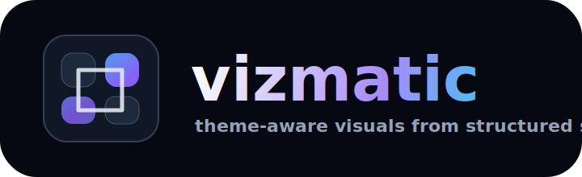

<p align="center">
  
</p>

<p align="center">
  <strong>Theme-aware visuals from structured scenes.</strong><br/>
  Give AI agents typed primitives. Get polished diagrams, figures, dashboards, and slide frames.
</p>

<p align="center">
  <a href="https://github.com/bvolpato/vizmatic/actions/workflows/ci.yml"></a>
  <a href="https://github.com/bvolpato/vizmatic/blob/main/LICENSE"></a>
  <a href="https://www.npmjs.com/package/vizmatic"></a>
</p>

<p align="center">
  
</p>

<p align="center">
  <a href="https://bvolpato.github.io/vizmatic/">Website</a> ·
  <a href="examples">Examples</a> ·
  <a href="#quick-start">Quick Start</a> ·
  <a href="#why-vizmatic">Why Vizmatic</a> ·
  <a href="#api">API</a>
</p>

---

## Quick Start

```bash
pnpm add vizmatic react
```

Create a frame:

```tsx
import React from "react"
import { defineIllustration, Flow, Scene } from "vizmatic"

export const width = 1040
export const height = 560

const frame = defineIllustration((c) => (
  <Scene c={c} title="Agent visual pipeline">
    <Flow
      c={c}
      stages={[
        { title: "Prompt", subtitle: "intent", tone: "blue" },
        { title: "Scene spec", subtitle: "typed structure", tone: "purple" },
        { title: "PNG / SVG", subtitle: "rendered artifact", tone: "green" },
      ]}
    />
  </Scene>
))

export const create = frame.create
export default frame.default
```

Render it:

```bash
vizmatic render ./frame.tsx --out ./dist/frames --theme dark,light --brand "Acme"
```

Or call the renderer directly:

```ts
import { renderToPng } from "vizmatic"
import { create, width, height } from "./frame"

await renderToPng(create("dark"), {
  width,
  height,
  outputPath: "dist/agent-pipeline.png",
  brand: "Acme",
})
```

## Why Vizmatic

Models can write structure reliably. They are worse at raw SVG path work, fragile coordinate math, and one-off design choices.

Vizmatic gives them a constrained visual language:

| Need | Vizmatic answer |
|---|---|
| Rich educational illustrations | React primitives rendered through Satori and resvg |
| Theme-aware output | Semantic tones and dark/light theme tokens |
| Agent-friendly authoring | JSX scene modules with simple props |
| Reproducible artifacts | Pure Node render path, no browser required |
| Safer generated visuals | Overflow detection, autocrop, wrapping-safe labels |
| Docs and decks | Same frame can become article art, report figure, or presentation slide |

## Gallery

<p>
  
  
</p>
<p>
  
  
</p>
<p>
  
  
</p>

More examples live in [`examples/`](examples) and on the [website](https://bvolpato.github.io/vizmatic/).

## API

### Themes

```ts
import { getThemeColors } from "vizmatic"

const dark = getThemeColors("dark")
const light = getThemeColors("light")
```

Primitives receive `c`, the resolved theme object. This keeps every visual connected to one palette, typography scale, and contrast model.

### Component catalog

Vizmatic exports a fairly complete visual kit. Common cases should use these primitives before dropping to raw SVG or absolute positioning.

#### Frame and layout

| Component | Use |
|---|---|
| `defineIllustration` | Wraps a theme-aware frame builder and exports `create(theme)` plus a default element. |
| `Canvas` | Low-level full-frame root with background, padding, and vertical alignment. |
| `Scene` | Standard frame wrapper with title, subtitle, content column, and theme-aware typography. |
| `TitleBar` | Shared title/subtitle block used by `Scene`. |
| `Row` / `Column` | Flex layout primitives with gap, alignment, wrapping, width, and height props. |
| `Stack` | Layered vertical stack for repeated cards, tokens, or processing layers. |

#### Surfaces, labels, and cards

| Component | Use |
|---|---|
| `Panel` | Titled card surface with tone strip, subtitle, footer, shadow, and body controls. |
| `Card` | Flexible surface for custom content without a forced title. |
| `StepCard` | Compact stage card for flows, choices, and process steps. |
| `MetricCard` | KPI/value card with label, value, detail, tone, and monospace value support. |
| `CalloutCard` | Highlight block for takeaways, warnings, decisions, and summaries. |
| `WindowFrame` | Browser/terminal-style framed panel for code, UI, or tool output. |
| `Box` | Gradient or outlined labeled rectangle with optional icon and sublabel. |
| `Tile` / `TileGrid` | Uniform repeated tiles with tone, title, detail, and metric layouts. |
| `Badge` / `BadgePill` | Small labels for status, categories, and annotations. |
| `ValuePill` | Compact value badge for numbers or short state labels. |
| `GradientChip` | Small colored chip with gradient fill for legends and tone keys. |
| `ToneStrip` | Small semantic accent strip for visual grouping. |
| `TextLabel` | Wrapping-safe text with variant, color, math formatting, width, and alignment. |
| `MathText` / `formatMathText` | Converts simple `x_i` / `x^2` style strings into readable unicode math text. |
| `SvgMathText` | SVG text helper for math labels inside custom plots. |

#### Arrows, connectors, and SVG helpers

| Component | Use |
|---|---|
| `Arrow` | Simple directional arrow element. |
| `FlowArrow` / `Connector` | Theme-aware connector between flow stages. |
| `VectorArrow` | SVG vector arrow for coordinate-style diagrams. |
| `VectorSegment` | Labeled segment/vector primitive for geometry and embedding visuals. |
| `SvgFrame` | SVG container with theme-aware background and border. |
| `SvgPoint` / `DotPoint` | Point markers with optional labels. |
| `ArrowMarkerDef` | SVG arrowhead marker definition for custom line charts and graph edges. |
| `DashedLine` | Dotted/dashed SVG line helper. |
| `Legend` | Reusable legend block with colored items and optional title. |

#### Lists, comparisons, and status blocks

| Component | Use |
|---|---|
| `DetailList` | Compact repeated detail rows inside panels and flow stages. |
| `ProgressRow` / `ProgressList` | Progress bars with labels, values, tones, and optional math text. |
| `StatusRow` / `StatusList` | Check, cross, warning, info, pending, and dot rows. |
| `KeyValueList` | Structured label/value rows for configs and metadata. |
| `CodeBlock` | Themed code panel with highlighted lines and optional annotations. |
| `EquationCard` | Formula card with title, equation, and supporting detail. |
| `Comparison` | Side-by-side comparison panel with two titled sides and detail rows. |

#### Flows, pipelines, and graph diagrams

| Component | Use |
|---|---|
| `Flow` | Horizontal or vertical staged process diagram with optional detail rows. |
| `Pipeline` | Process pipeline with stage labels and a shared title. |
| `LayeredNetwork` | Neural-network/DAG diagram with layers, nodes, active path, annotations, and formula. |
| `GraphDiagram` | Positioned node-edge graph with labels, dashed/muted edges, and tone-aware nodes. |

#### Matrices, tables, and grids

| Component | Use |
|---|---|
| `Matrix` | Numeric matrix visualization for linear algebra and attention examples. |
| `Heatmap` | Color-scaled matrix/attention heatmap. |
| `TiledMatrix` | Matrix with region labels and grouped tiles. |
| `DataTable` | Compact text table with header rows/columns and monospace cells. |
| `Grid` | General-purpose cell grid with per-cell label, tone, color, border, and opacity. |

#### Charts and plots

| Component | Use |
|---|---|
| `ChartFrame` | Shared chart wrapper with title, subtitle, footer, and theme-aware shell. |
| `AxisPlot` | Low-level axis plot for custom lines, paths, and plotted values. |
| `MiniBarChart` | Small bar chart for cards and dashboards. |
| `StackedBar` | Segmented horizontal bar with labels and percentages. |
| `BarChart` | Full bar chart with ticks, labels, values, grids, and formats. |
| `LineChart` | Multi-series line chart with optional area fill, points, labels, and grid. |
| `ScatterPlot` | Labeled scatter plot with axes, ticks, point sizing, and collision-aware labels. |
| `QuadrantChart` | 2x2 decision matrix with regions, labeled points, and axis labels. |
| `IntervalPlot` | Timeline/range plot for spans, phases, latencies, and schedules. |

#### Rendering and verification

| API | Use |
|---|---|
| `renderToPng` | Render React scene to PNG through Satori and resvg, with optional brand mark, crop, scale, and overflow check. |
| `renderToBuffer` | Render PNG to memory for tests and pipelines. |
| `renderToSvg` | Render SVG markup directly. |
| `wrapWithBrand` | Add an optional top-right brand label to a frame. |
| `detectBackgroundColor` | Find dominant transparent/background color for cropping. |
| `detectContentBounds` | Compute non-background bounds for autocrop. |
| `cropPixels` | Crop raw pixel buffers. |
| `detectOverflow` | Fail frames that clip content at canvas edges. |

### Rendering

```ts
import { renderToPng, renderToBuffer, renderToSvg } from "vizmatic"
```

`renderToPng` renders at 2x scale by default, checks for clipped content, crops extra vertical whitespace, and can apply an optional brand mark.

```ts
await renderToPng(element, {
  width: 1040,
  height: 560,
  outputPath: "dist/frame.png",
  brand: "Your Product",
  crop: true,
  scale: 2,
})
```

## Project Layout

```text
src/
  theme.ts        semantic colors, tones, typography
  primitives.ts   reusable scene building blocks
  render.ts       Satori -> SVG -> resvg -> PNG
  autocrop.ts     content bounds and overflow checks
  cli.ts          vizmatic render
examples/
  *.tsx           generated gallery frames
docs/
  index.html      static website for GitHub Pages
```

## Development

```bash
pnpm install
pnpm test
pnpm render:examples
pnpm site:serve
```

## Publishing

```bash
pnpm test
pnpm render:examples
npm publish --access public
```

## License

MIT
